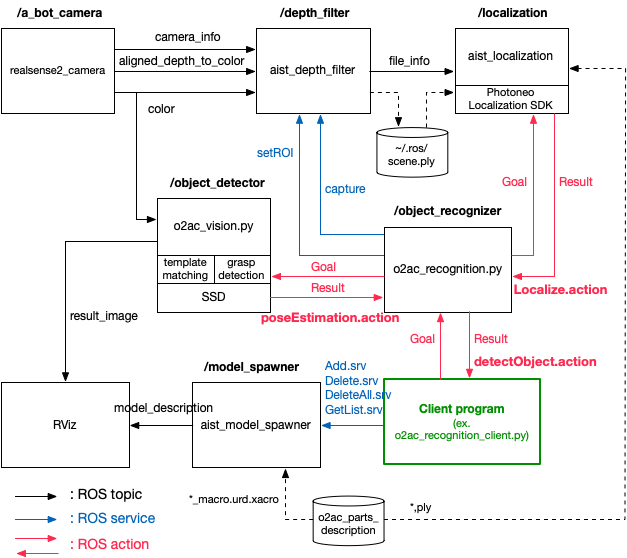

o2ac_vision
===============
## Introduction

This package contains nodes that execute and advertise vision actions, e.g.:

- Object detection
- Part pose estimation
- Belt pick-pose detection

All vision skills should be action-based, so that calculations are allowed to fail and time out.

For this, the Python nodes should advertise a number of actions, which are defined in o2ac_msgs.


## Part recognition
The part recognition node consists of two components. One is the object detection, the other is pose estimation.


### Object detection
Python scripts of Single Shot MultiBox Detector (SSD) are cloned from [ssd.pytorch](https://github.com/amdegroot/ssd.pytorch).
This module detects multiple objects in a tray. A list of bounding boxes, classes, and confidences are returned.


### Pose estimation
This component estimates accurate pose (x,y,theta) of **small targets** in image coordinate system. It feeds the output of the object detection module, a list of bounding box and object class id.

You can try this component using the following commands:
```bash
$ rosrun o2ac_vision pose_estimation_server.py
$ rosrun o2ac_vision pose_estimation_client.py --id [image id] --tdir [path]
```
Options:  
- --id ... Index of the input image.  
- --tdir ... Path to template info (template_info.json).  


### Belt detection
You can try this component using the following commands:
```bash
$ rosrun o2ac_vision belt_detection_server.py
$ rosrun o2ac_vision belt_detection_client.py
```


## Dataset
All data including the pre-trained model of SSD, templates, and image sets can be download from following link.
Please put `dataset.zip` in the directory "src/WRS_Dataset" and unzip it.
Make sure "Annotations", "Images", "data", "labels.txt", "realsense_intrinsic.json", and "ssd.pytorch" are in "src/WRS_Dataset".

[Download LINK](https://since1954-my.sharepoint.com/:f:/g/personal/z119104_since1954_onmicrosoft_com/EjnbKhpQsTRGnJWvP5ivM9sB3IzRr7gdRk0klG6oxHJyAQ?e=A3sxj1)


## Test
You can try this component using the following commands:
```
$ rosrun o2ac_vision ssd_server.py
$ rosrun o2ac_vision pose_estimation_server.py
$ rosrun o2ac_vision belt_detection_server.py
$ rosrun o2ac_vision server.py
$ rosrun o2ac_vision client.py --id [image id] --tdir [path]
```
## Recognition pipeline
A pipeline from image acquisition to object recognition and 3D pose estimation is constructed with a series of nodes defined in the vision pacages, .e.g. `o2ac_vision`, `aist_depth_filter`, `aist_localization` and `aist_model_spawner`(optional). You can setup the pipeline for a realsense camera by typing
```bash
$ roslaunch o2ac_vision realsense.launch
$ rosrun o2ac_vision o2ac_recognition_client.py
```
which establishes node connections shown in the figure below;



Users' node is displayed in green color. This is a client node of `o2ac_msgs.detectObjectAction` which is defined as;
```
# Goal
string item_id
# (optional)
geometry_msgs/PoseWithCovarianceStamped expected_pose
---
# Result
bool succeeded
float32[] confidences
geometry_msgs/PoseStamped[] detected_poses
# (optional)
geometry_msgs/PoseWithCovarianceStamped[] detected_poses_with_covariance
---
# Feedback 
```
The client requests the `/object_recognizer` to find objects specified in the `item_id` field of the action goal. Currently, `item_id` should be a mesh file name excluding its suffix defined in `o2ac_parts_description/meshes`, ex. 01-Base, 04_37D-GEARMOTOR-50-70, 08_KZAF1075NA4WA55GA20AA0, etc.

The pipeline works in the following manner;

1. When the ID of object to be recognized is given in the goal of `o2ac_msgs.detectObjectAction` type, the `/object_recognizer` sends a goal of `o2ac_msgs.poseEstimationAction` type to the `/object_detector`.
2. The `/object_detector` searches for the all known objects in a input color image by applying SSD, and then returns part ID and a bounding box to the `/object_recognizer` for each object found.
3. For each of small parts, the `/object_detector` also applies template matching which determines its 2D position and orientation of within the bounding box. They are returned to the `/object_recognizer` together with SSD results.
4. For the round belt, the `/object_detector` finds grasp points by applying the FGE(Fast Graspability Estimation) detector. The grasp points are represented by its 2D position and orientation of the two-finger gripper's motion axis. Multiple grasp points may be found from a single belt in general. They are returned to the `/object_recognizer` together with SSD results.
5. After receiving part ID and the bounding box, the `/object_recognizer` commands the `/depth_filter` to create a point cloud within a subregion corresponding to the bounding box. The created point cloud is stored in `~/.ros/scene.ply` in the Stanford PLY format.
6. For general parts neither small nor belts, the `/localization` node restores the PLY file and performs 3D matching with the meshes stored in `o2ac_parts_description`. If the matching process succeeds, the 3D position and orientation of the part as well as confidence values are returned in the result of `o2ac_msgs.detectObjectAction` type. If multiple candidate poses are found, they are stored with the descending order of confidence values.
7. For small parts and belts, the `/localization` node converts their 2D positions and orientations to 3D poses under an assumption that the objects lie on a "dominant plane". The "dominant plane" is detected from the entire depth image by the `/depth_filter` with robust plane fitting using RANSAC. The detected plane is published in the message of `aist_depth_filter.FileInfo` type and subscribed by the `/localization` node.

The sample client program `o2ac_vision/scripts/o2ac_recognition_client.py` gives an example showing how to use the recognition pipeline from users' application programs. The sample also provides a means for visualizing 3D localization results using `aist_model_spawner`.